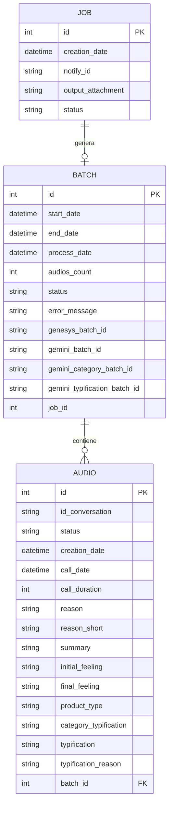

# Bases de datos

## Información General

El proyecto **audio-extract** utiliza una base de datos **PostgreSQL** para almacenar y gestionar la información relacionada con el procesamiento de audios extraídos del sistema Genesys. 

La base de datos se configura mediante variables de entorno que definen:
- Host del servidor PostgreSQL
- Puerto de conexión
- Nombre de la base de datos
- Usuario y contraseña de acceso

La conexión se establece utilizando **SQLAlchemy** como ORM (Object-Relational Mapping), lo que permite interactuar con la base de datos mediante objetos Python en lugar de consultas SQL directas.

Todas las tablas se encuentran en el esquema **`audios_sac`**.

## Diagrama de Base de Datos

## Descripción de Tablas

| Tabla | Descripción | Propósito Principal |
|-------|-------------|---------------------|
| **batch** | Almacena información sobre lotes de procesamiento de audios | Gestionar el procesamiento por lotes de audios, incluyendo referencias a Genesys y Gemini, así como el seguimiento del estado de procesamiento |
| **audio** | Contiene los datos detallados de cada audio procesado | Almacenar información completa de las conversaciones telefónicas, incluyendo metadatos, análisis de sentimientos, tipificaciones y resúmenes generados |
| **job** | Registra los trabajos o tareas de procesamiento | Controlar y dar seguimiento a las tareas de procesamiento, incluyendo notificaciones y archivos de salida generados |

## Relaciones Principales

**1. BATCH → AUDIO (Uno a Muchos)**
- Un lote (batch) puede contener múltiples audios
- Relación establecida mediante la clave foránea `batch_id` en la tabla `audio`
- Permite agrupar audios procesados en un mismo lote para su gestión conjunta

**2. JOB → BATCH (Uno a Uno)**
- Un trabajo (job) puede generar un lote de procesamiento
- Relación establecida mediante el campo `job_id` en la tabla `batch`
- Permite rastrear qué trabajo generó cada lote de procesamiento

**Características de las relaciones:**
- La tabla **batch** actúa como tabla intermedia entre **job** y **audio**
- Los audios se organizan en lotes que a su vez están asociados a trabajos específicos
- El esquema permite un procesamiento jerárquico: Job → Batch → Audios
- Cada nivel mantiene su propio estado de procesamiento independiente

